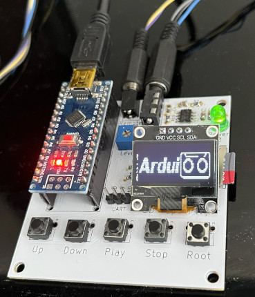

# SD_Tape_Player
Play computer cassette data audio files from a micro SD card with Arduino Nano  
  
This pcb was tested with the Arduino sketch for CASDuino 1.24 obtained here http://arduitape.blogspot.com/2020/08/new-castzxduino-firmware.html
